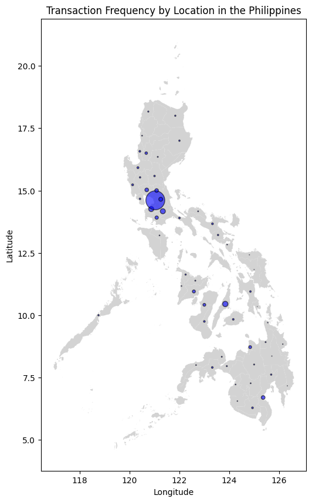

BPI DATA SCIENCE INTERNSHIP PROGRAM 2024 PROJECT

# Clustering of Credit Card Users

| | |
| :-------------------- | :-------------------: |
| **Project Start Date:** | June 13, 2024  |
| **Project End Date:** | August 6, 2024   |
| **Project Creators:** | Isaiah John Mariano, Jeremiah Daniel Regalario   |
| **University:** | University of the Philippines - Diliman   |
| **Project Tags:**  | _k-means_, _pca_, _credit card_  |

---

## Introduction

Banks in modern day Philippines typically tailor their services in order to meet the specific needs of their different customer groups. However, addressing the unique preferences of the multitude of characteristics of the customers in the country remains a huge challenge.

This project attempts to cluster BPI credit card users using data provided by BPI. Nine datasets were provided, and exploratory data analysis (EDA) was conducted on all of them to gain useful insights and to determine which parts of the data to consider in the clustering process.

---

## Methods

### Data Preparation

- Extracted each dataset.
- Applied cleaning and filtering: removal of duplicate entries, renaming of columns, and removal of null values.

### Exploratory Data Analysis

- Rendered univariate plots (histograms, bar charts, pie charts) to understand demographics and spending distributions.
- Conducted bivariate analysis using boxplots, scatterplots, and bar plots to present relationships between two variables.
- Created multivariate analyses including scatterplots, box plots, 3D plots, and Pearson correlation heatmaps.
- Plotted mean and median plots and removed null values where necessary.

| Map of Transactions |
| -------------------- |
|  |

### Feature Engineering

- Added Recency, Frequency, and Monetary features for RFM analysis.
- Converted categorical features into numerical ones:
  - One-Hot Encoding for: `BUSINESS_OWNER`, `DIGITAL_FLAG`, `INCOME_SOURCE`, `IDV_OR_ORG`, `GENDER`, `MARITAL_STATUS`.
  - Label Encoding for ordinal features: `EDUCATION`, `REGION`, `SUBSEGMENT` (Sethi, 2023).
- Applied logarithmic transformation to reduce right-skewness and the impact of outliers (preferred by K-Means).
- Standardized features using `StandardScaler` so all features are on the same scale (Ryzhkov, 2020).

### Clustering

- Algorithm used: **K-Means** with **PCA** for dimensionality reduction.
- Decided to retain **25 features** based on explained variance ratio.

---

## Results

- Explained Variance Ratio was used to select components; 25 features retained.
- Cluster validation:
  - Elbow method suggests a large number of clusters.
  - Silhouette scores were low (approximately 0.11–0.24), indicating clusters are not very well separated.

---

## Discussion

*(Content was present in the original document but left visually sparse. Consider adding interpretation of clusters, characteristics of each cluster, business implications, and recommended next steps.)*

---

## Appendix

### Changes Made

- Cluster validation techniques were added.
- Graphs showing characteristics of the target segment were added.

### AI Models / Tools Referenced

- ChatGPT. (September 21, 2023). *Customer Segmentation Guide*.
- ChatGPT. (October 13, 2023). *Insurance Requirements by Employment Type*.
- Claude. (October 13, 2023). *Key elements of a health insurance business model*.

---

## Core Contributors

- [Jeremiah Daniel Regalario](https://github.com/jeremiahdanielregalario)
- [Isaiah John Mariano](https://github.com/ice-leo)

## References

- Chandra, M. G. (2021). *9 Clustering Techniques for Customer Segmentation*. Kaggle. https://www.kaggle.com/code/gaganmaahi224/9-clustering-techniques-for-customer-segmentation/notebook#Data-visualisation.
- Connectif. (July 18, 2022). *What Are RFM Scores and How to Calculate Them*. https://connectif.ai/en/blog/what-are-rfm-scores-and-how-to-calculate-them/
- DataReportal. (February 9, 2023). *Digital 2023: Philippines*. https://datareportal.com/reports/digital-2023-philippines
- Google Developers. (n.d.). *Advantages and Disadvantages of Clustering Algorithms*. https://developers.google.com/machine-learning/clustering/algorithm/advantages-disadvantages
- Kar, S. (2021). *Customer Segmentation - EDA & Clustering (K-Means)*. Kaggle. https://www.kaggle.com/code/sonerkar/customer-segmentation-eda-clustering-kmeans?fbclid=IwAR2lch1pmauPuUNVgg387VjY-vk11wBTKYzY1afN6SthUXAgCH3nzxE9_Do
- Kwiatkowska, P. (2019). *Bank Customer Segmentation*. Kaggle. https://www.kaggle.com/code/paulinan/bank-customer-segmentation?fbclid=IwAR0qt7ofRkp-bNJkUYNq35oCZtum51ljZ_h3fnRwlCD75V__7XVVqKi54qo
- LinkedIn. (n.d.). *How Do You Validate and Compare Clustering Results with Missing Data?*
- Mohanty, S. K. (2021). *Customer Segmentation - K-Means, DBSCAN, GMM, Agglo*. Kaggle. https://www.kaggle.com/code/sidharth178/customer-segmentation-kmeans-dbscan-gmm-agglo
- MoneyMax Philippines. (December 27, 2017). *Savings Account vs. Current Account*. https://www.moneymax.ph/personal-finance/articles/savings-account-vs-current-account
- Ryzhkov, E. (July 23, 2020). *5 Stages of Data Preprocessing for K-Means Clustering*. https://medium.com/@evgen.ryzhkov/5-stages-of-data-preprocessing-for-k-means-clustering-b755426f9932
- Sethi, A. (July 15, 2023). *One-Hot Encoding vs. Label Encoding using scikit-learn*. Analytics Vidhya. https://www.analyticsvidhya.com/blog/2020/03/one-hot-encoding-vs-label-encoding-using-scikit-learn/
- Sharma, A. (2020, September 7). *How to Master the Popular DBSCAN Clustering Algorithm for Machine Learning*. Analytics Vidhya. https://www.analyticsvidhya.com/blog/2020/09/how-dbscan-clustering-works/
- Shawky Elgendy (n.d.). *Customer Segmentation - EDA, K-Means, PCA*. Kaggle. https://www.kaggle.com/code/shawkyelgendy/customer-segmentation-eda-k-means-pca/notebook?fbclid=IwAR1cig7xnspaDnVLqZ28klS7Qm9PPesx12olVu5gcfK--E4hqBMPL3ps0gg
- Yadav, N. (n.d.). *Customer Segmentation using K-Means, HC, DBSCAN*. Kaggle. https://www.kaggle.com/code/niteshyadav3103/customer-segmentation-using-kmeans-hc-dbscan

---
