BPI DATA SCIENCE INTERNSHIP PROGRAM 2024 PROJECT

# Clustering of Credit Card Users

<table>
  <tbody>
    <tr>
      <th scope="row">Project Start Date</th>
      <td>June 13, 2024</td>
    </tr>
    <tr>
      <th scope="row">Project End Date</th>
      <td>August 6, 2024</td>
    </tr>
    <tr>
      <th scope="row">Project Creators:</th>
      <td>Isaiah John Mariano, Jeremiah Daniel Regalario</td>
    </tr>
    <tr>
      <th scope="row">University</th>
      <td>University of the Philippines - Diliman</td>
    </tr>
    <tr>
      <th scope="row">Project Tags</th>
      <td><em>k-means</em>, <em>pca</em>, <em>credit card</em></td>
    </tr>
  </tbody>
</table>

---

## Introduction

Banks in modern day Philippines typically tailor their services in order to meet the specific needs of their different customer groups. However, addressing the unique preferences of the multitude of characteristics of the customers in the country remains a huge challenge.

This project attempts to cluster BPI credit card users using data provided by BPI. Nine datasets were provided, and exploratory data analysis (EDA) was conducted on all of them to gain useful insights and to determine which parts of the data to consider in the clustering process.

## Methods

### Data Preparation

- Extracted each dataset.
- Applied cleaning and filtering: removal of duplicate entries, renaming of columns, and removal of null values.

### Exploratory Data Analysis

- Rendered univariate plots (histograms, bar charts, pie charts) to understand demographics and spending distributions.
- Conducted bivariate analysis using boxplots, scatterplots, and bar plots to present relationships between two variables.
- Created multivariate analyses including scatterplots, box plots, 3D plots, and Pearson correlation heatmaps.
- Plotted mean and median plots and removed null values where necessary.

| Map of Transactions |
| -------------------- |
|  |

| Aggregated Transactions |
| -------------------- |
| 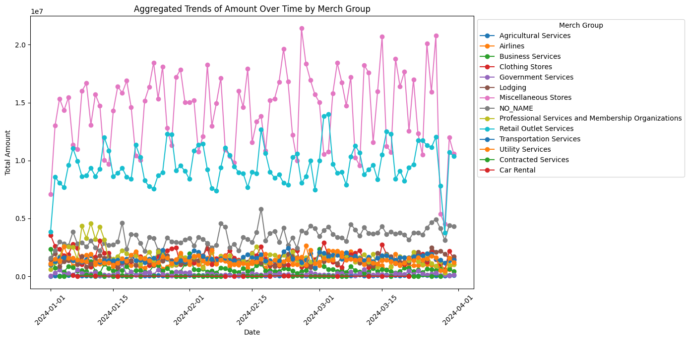 |

| Heatmap of Numerical Features |
| -------------------- |
| 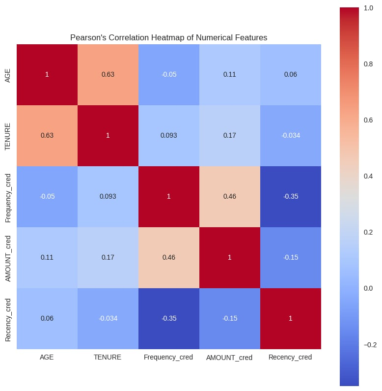 |

| Merch Group + Channel Barplot |
| -------------------- |
| 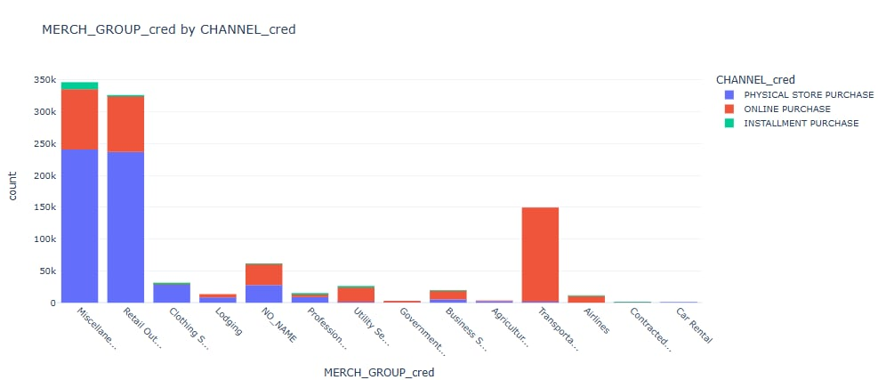 |

### Feature Engineering

- Added Recency, Frequency, and Monetary features for RFM analysis.
- Converted categorical features into numerical ones:
  - One-Hot Encoding for: `BUSINESS_OWNER`, `DIGITAL_FLAG`, `INCOME_SOURCE`, `IDV_OR_ORG`, `GENDER`, `MARITAL_STATUS`.
  - Label Encoding for ordinal features: `EDUCATION`, `REGION`, `SUBSEGMENT` (Sethi, 2023).
- Applied logarithmic transformation to reduce right-skewness and the impact of outliers (preferred by K-Means).
- Standardized features using `StandardScaler` in some trials and `MinMaxScaler` in other trials so all features are on the same scale (Ryzhkov, 2020).

### Clustering

- Algorithm used: **K-Means** with **PCA** for dimensionality reduction.
- Decided to retain **5 features** based on explained variance ratio.

## Results

- Trial 3 had the best results (MinMax Scaler used on all features)
- Hyperparameter Tuning:
  - Best Number of Clusers: **10**
  - Silhouette Score: **0.5992**
- Cluster validation:
  - Elbow method suggests **5** as the number of clusters with silhouette score **~0.5**

The following summarizes the clustering trials and their EDA/validation findings.

### Trial 1

**File:** `clustering_trial_1.ipynb`  
**Dataset:** `minmax_scaled_all_except_long_lat_df.parquet`  
**Preprocessing / Characteristics:** Scaled all features *except* Flags, Longitude, Latitude (MinMaxScaler). Tenure correlated with Age (≈0.64); Frequency correlated with Amount (≈0.43).  
**PCA:** chose **5 components** based on explained variance.  
**Hyperparameter tuning:** grid search over `n_clusters=2..10`, silhouette as metric, `random_state=42`.  
- **Best params:** `{'algorithm':'lloyd','init':'k-means++','n_clusters':2,'n_init':10}`  
- **Best silhouette:** `0.5575`  
**Elbow / Silhouette:** n=2 gave high silhouette but not clear elbow; cluster 2 used for deeper EDA.  
**Cluster EDA (summary):**
- Clustering appears influenced by unscaled longitude/latitude — clusters correspond to geography (Cluster 1 ≈ Luzon, Cluster 2 ≈ Visayas & Mindanao).
- Demographics (age, tenure, recency) similar across clusters; Cluster 1 has higher spend and frequency.
- 
- 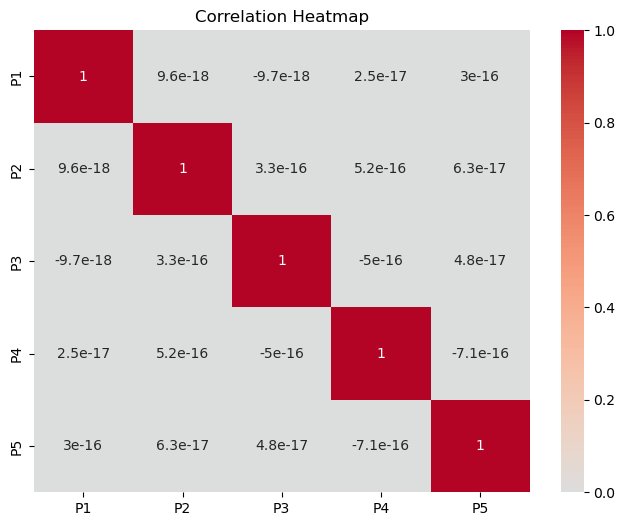
- 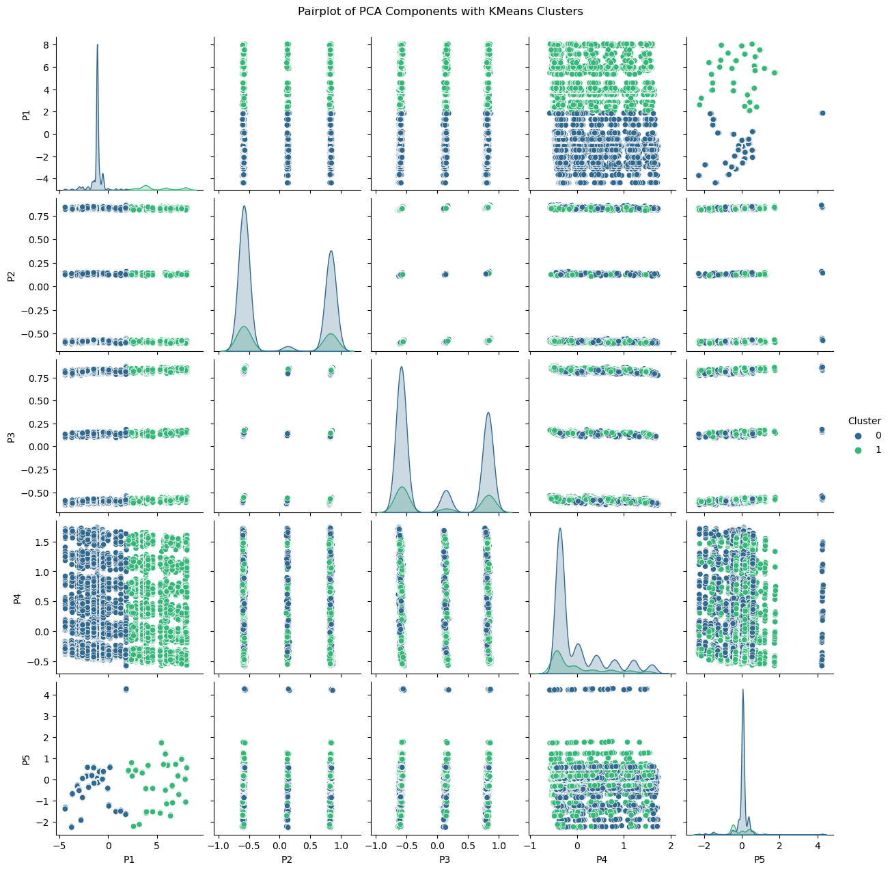
- 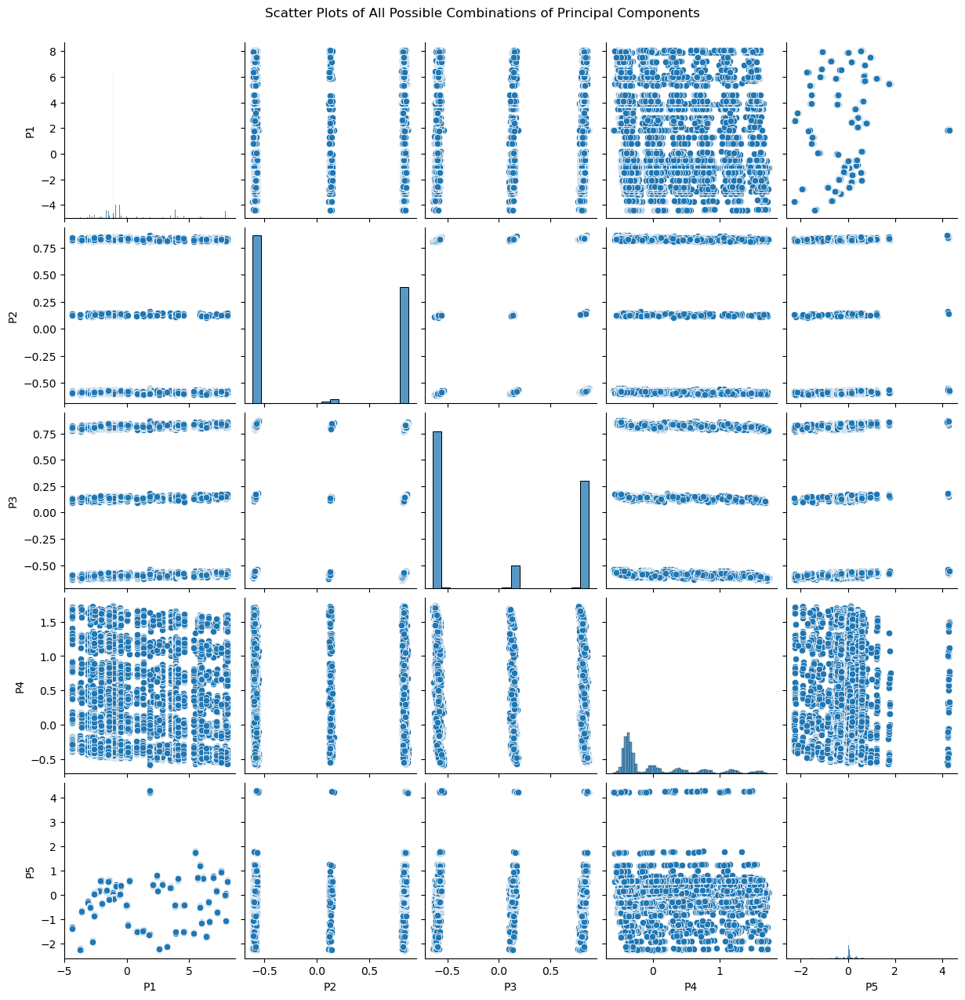
- 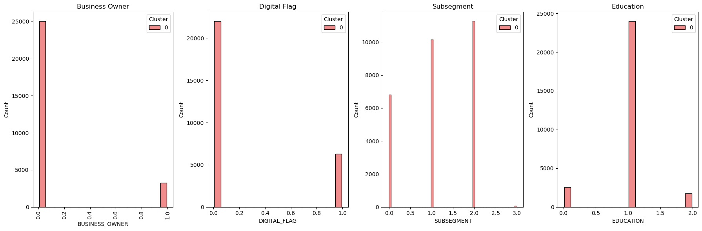
- 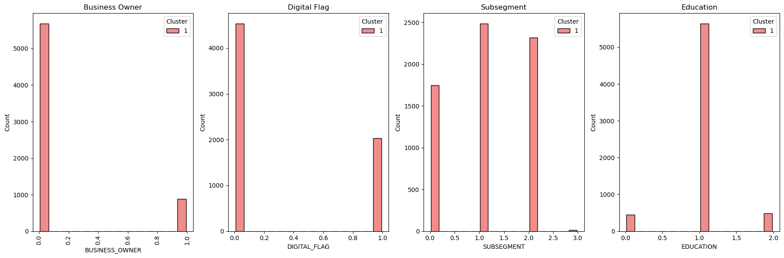

### Trial 2
**File:** `clustering_trial_2.ipynb`  
**Dataset:** `minmax_scaled_all_except_long_lat_df.parquet` (same scheme as Trial 1).  
**PCA:** chose **5 components**.  
**Hyperparameter tuning:** same search (2–10 clusters), silhouette metric.  
- **Reported best params (initial):** same as Trial 1 (n_clusters=2, silhouette ≈ 0.5575).  
- The team also examined **n = 6** for further insight.  
**Cluster EDA (summary):**
- Geographic separation again visible (likely due to longitude/latitude not scaled):
  - Cluster 5 → Northern Luzon
  - Clusters 1, 3, 4 → Southern Luzon + NCR
  - Cluster 0 → Visayas
  - Cluster 2 → Mindanao
- Clusters 1/3/4 show higher spend (Southern Luzon + NCR); clusters 2 & 5 show lower frequency.
**Placeholders for images:**
- 
- 
- 
- 
- 

### Trial 3
**File:** `clustering_trial_3.ipynb`  
**Dataset:** `minmax_scaled_all_df.parquet` (scaled all features).  
**Preprocessing:** MinMaxScaler on all features.  
**PCA:** chose **5 components**.  
**Hyperparameter tuning:** n=2..10, silhouette metric, `random_state=42`.  
- **Best params:** `{'algorithm':'lloyd','init':'k-means++','n_clusters':10,'n_init':30}`  
- **Best silhouette:** `0.59928`  
**Elbow / Decision:** although tuning returned n=10 with better silhouette, elbow suggests **n = 5** with silhouette > 0.5; the team chose **n = 5** for interpretability.  
**Cluster EDA (summary):**
- Fewer obvious RFM distinctions except:
  - **Cluster 2:** higher frequency and amount (higher spenders).
  - **Cluster 4:** older-age-heavy cluster.
- Other clusters show similar distributions in many RFM features.
**Placeholders for images:**
- 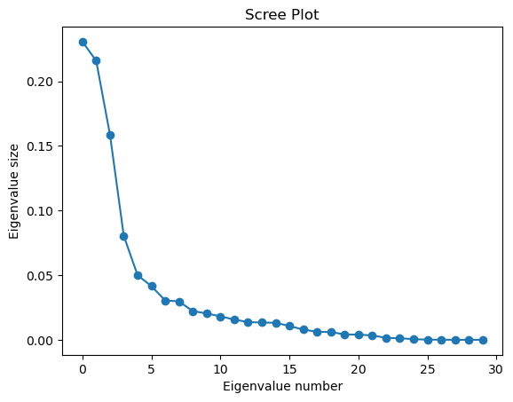
- 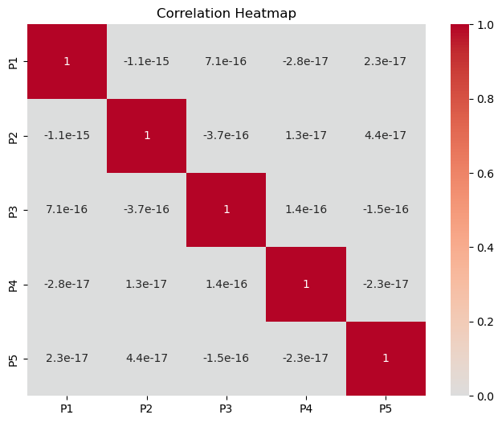
- 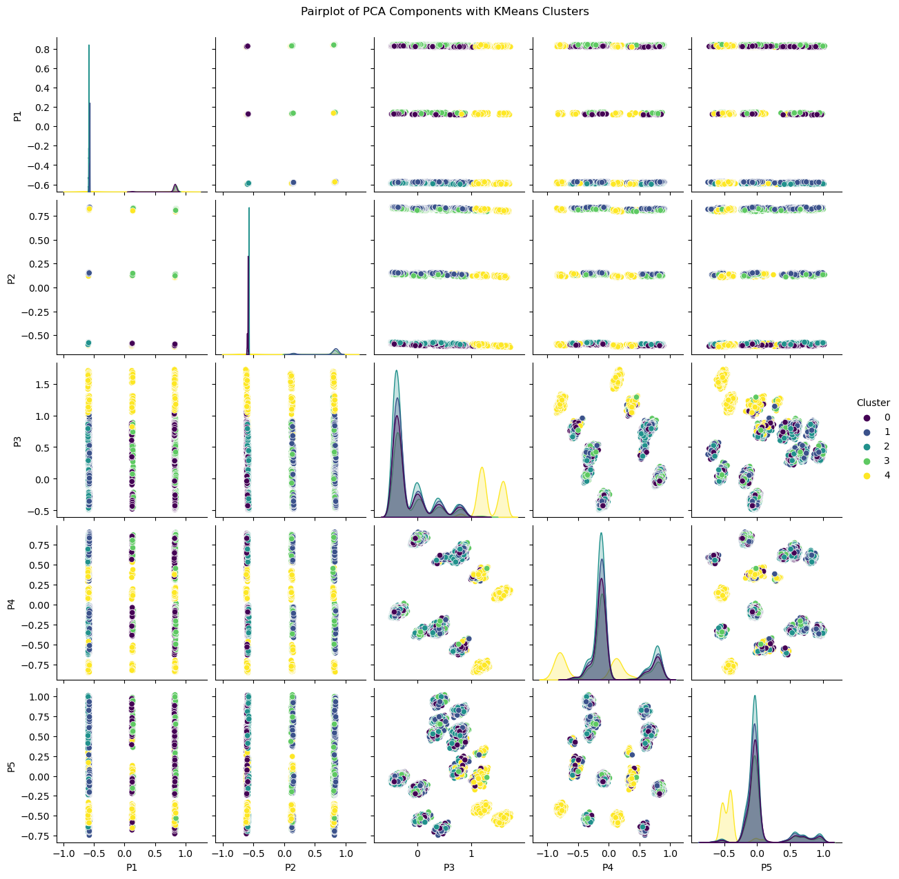
- 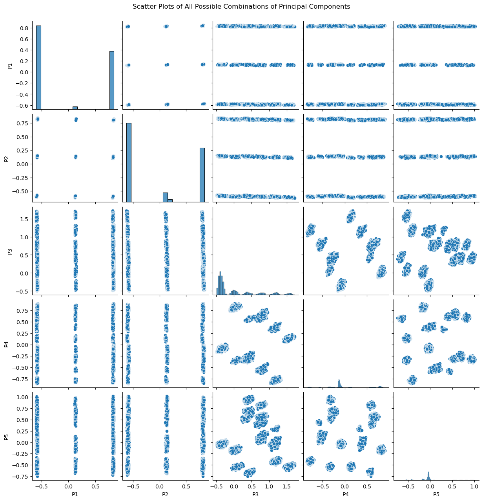
- 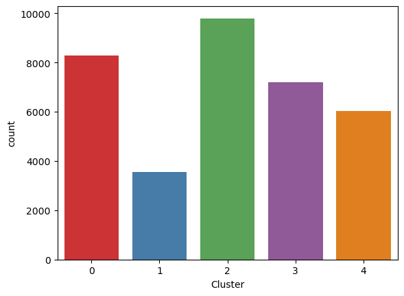

### Trial 4
**File:** `clustering_trial_4.ipynb`  
**Dataset:** `minmax_binned_scaled_all_except_long_lat_df.parquet` (scaled except long/lat; binned / Qcut RFM).  
**PCA:** chose **7 components**.  
**Hyperparameter tuning & selection:** elbow indicated **n = 8** (silhouette ≈ 0.35); team selected n=8.  
**Cluster EDA (summary):**
- Clustering heavily influenced by geography (longitude/latitude not scaled).
- Highest transaction amounts concentrated in NCR.
- Clusters 0, 6, 4 have the highest transaction amounts.
- 
- 
- 
- 
- 

### Trial 5
**File:** `clustering_trial_5.ipynb`  
**Dataset:** `stdscale_binned_scaled_all_notenfreq_df.parquet` (StandardScaler; Tenure & Frequency **NOT** included; Qcut RFM).  
**PCA:** chose **6 components**.  
**Hyperparameter tuning / selection:** elbow indicated **n = 8** (silhouette ≈ 0.32); team used n=8.  
**Cluster EDA (summary):**
- Clusters 2 and 4: older demographics (especially cluster 4).
- Clusters 6 and 2: highest transaction amounts.
- Some clusters show strong business-owner signals vs. salary-based customers; variations in digital/traditional channel usage across clusters.
- 
- 
- 
- 

### Trial 6 — Other algorithms (DBSCAN)
**File:** `clustering_trial_6.ipynb`  
**Dataset:** same as Trial 5 (`stdscale_binned_scaled_all_notenfreq_df.parquet`).  
**Approach:** evaluated DBSCAN over eps/min_samples to find stable cluster counts.  
**Selected parameters:** `min_samples = 450`, `eps = 1.5` → **4 clusters** (reported silhouette ≈ 0.24). Noise points labeled as cluster `-1`.  
**Cluster EDA (summary):**
- DBSCAN produced some meaningful clusters but lower silhouette than best K-Means trials; useful to identify dense/rare segments vs. noise.
- 
- 
- 

## Discussion

- **Scaling matters.** Trials where longitude/latitude were not scaled resulted in strong geographic clusters, which may or may not be desired depending on the business question.
- **Best silhouette** observed in Trial 3 using K-Means (silhouette ≈ **0.5993**) but team chose **n = 5** after considering elbow & interpretability.  
- **Trying multiple scalers, feature selections, and clustering algorithms (K-Means, DBSCAN)** helped surface whether clusters are geography-driven or RFM-driven.
- **Next steps (recommended):**
  - Decide whether geographic separation is desired; if not, remove or properly scale longitude/latitude or encode geography more explicitly.
  - Add concise text descriptions for the final chosen clusters (business recommendations / use-cases).
  - Include final images (replace the placeholders above with the actual PNG/JPEGs under `./images/`) and consider an expanded Appendix with the full notebooks and parameter grids.

## Appendix

### Changes Made

- Cluster validation techniques were added.
- Graphs showing characteristics of the target segment were added.

### AI Models / Tools Referenced

- ChatGPT. (September 21, 2023). *Customer Segmentation Guide*.
- ChatGPT. (October 13, 2023). *Insurance Requirements by Employment Type*.
- Claude. (October 13, 2023). *Key elements of a health insurance business model*.

## Core Contributors

- [Jeremiah Daniel Regalario](https://github.com/jeremiahdanielregalario)
- [Isaiah John Mariano](https://github.com/ice-leo)

---

## References

- Chandra, M. G. (2021). *9 Clustering Techniques for Customer Segmentation*. Kaggle. https://www.kaggle.com/code/gaganmaahi224/9-clustering-techniques-for-customer-segmentation/notebook#Data-visualisation.
- Connectif. (July 18, 2022). *What Are RFM Scores and How to Calculate Them*. https://connectif.ai/en/blog/what-are-rfm-scores-and-how-to-calculate-them/
- DataReportal. (February 9, 2023). *Digital 2023: Philippines*. https://datareportal.com/reports/digital-2023-philippines
- Google Developers. (n.d.). *Advantages and Disadvantages of Clustering Algorithms*. https://developers.google.com/machine-learning/clustering/algorithm/advantages-disadvantages
- Kar, S. (2021). *Customer Segmentation - EDA & Clustering (K-Means)*. Kaggle. https://www.kaggle.com/code/sonerkar/customer-segmentation-eda-clustering-kmeans?fbclid=IwAR2lch1pmauPuUNVgg387VjY-vk11wBTKYzY1afN6SthUXAgCH3nzxE9_Do
- Kwiatkowska, P. (2019). *Bank Customer Segmentation*. Kaggle. https://www.kaggle.com/code/paulinan/bank-customer-segmentation?fbclid=IwAR0qt7ofRkp-bNJkUYNq35oCZtum51ljZ_h3fnRwlCD75V__7XVVqKi54qo
- LinkedIn. (n.d.). *How Do You Validate and Compare Clustering Results with Missing Data?*
- Mohanty, S. K. (2021). *Customer Segmentation - K-Means, DBSCAN, GMM, Agglo*. Kaggle. https://www.kaggle.com/code/sidharth178/customer-segmentation-kmeans-dbscan-gmm-agglo
- MoneyMax Philippines. (December 27, 2017). *Savings Account vs. Current Account*. https://www.moneymax.ph/personal-finance/articles/savings-account-vs-current-account
- Ryzhkov, E. (July 23, 2020). *5 Stages of Data Preprocessing for K-Means Clustering*. https://medium.com/@evgen.ryzhkov/5-stages-of-data-preprocessing-for-k-means-clustering-b755426f9932
- Sethi, A. (July 15, 2023). *One-Hot Encoding vs. Label Encoding using scikit-learn*. Analytics Vidhya. https://www.analyticsvidhya.com/blog/2020/03/one-hot-encoding-vs-label-encoding-using-scikit-learn/
- Sharma, A. (2020, September 7). *How to Master the Popular DBSCAN Clustering Algorithm for Machine Learning*. Analytics Vidhya. https://www.analyticsvidhya.com/blog/2020/09/how-dbscan-clustering-works/
- Shawky Elgendy (n.d.). *Customer Segmentation - EDA, K-Means, PCA*. Kaggle. https://www.kaggle.com/code/shawkyelgendy/customer-segmentation-eda-k-means-pca/notebook?fbclid=IwAR1cig7xnspaDnVLqZ28klS7Qm9PPesx12olVu5gcfK--E4hqBMPL3ps0gg
- Yadav, N. (n.d.). *Customer Segmentation using K-Means, HC, DBSCAN*. Kaggle. https://www.kaggle.com/code/niteshyadav3103/customer-segmentation-using-kmeans-hc-dbscan
